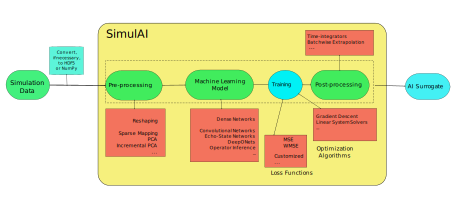

=======
SimulAI
=======
.. image:: figs/coverage.svg 
.. image:: https://readthedocs.org/projects/simulai-toolkit/badge/?version=latest
	:target: https://simulai-toolkit.readthedocs.io/en/latest/?badge=latest
	:alt: Documentation Status
    

A Python package with data-driven pipelines for physics-informed machine learning.

The SimulAI toolkit provides easy access to state-of-the-art models and algorithms for physics-informed machine learning. Currently, it includes the following methods described in the literature:

- Physics-Informed Neural Networks (PINNs)
- Deep Operator Networks (DeepONets)
- Variational Encoder-Decoders (VED)
- Operator Inference (OpInf)
- Koopman AutoEncoders (experimental)
- Echo State Networks (experimental GPU support)

In addition to the methods above, many more techniques for model reduction and regularization are included in SimulAI. See `documentation <https://simulai-toolkit.readthedocs.io/>`_.

Installing
==========

Python version requirements: 3.8 or 3.9

Using pip
---------

    $ pip install simulai-toolkit

Contributing code to SimulAI
============================

See `CONTRIBUTING <CONTRIBUTING.rst>`_.

Using MPI
=========

Some methods implemented on SimulAI support multiprocessing with MPI.

In order to use it, you will need a valid MPI distribution, e.g. MPICH, OpenMPI. As an example, you can use ``conda`` to install MPICH as follows: 

    $ conda install -c conda-forge mpich gcc

Issues with macOS
-----------------

If you have problems installing ``gcc`` using the command above, we recommend you to install it using `Homebrew <https://brew.sh>`_.

Documentation
=============

Please, refer to the SimulAI API `documentation <https://simulai-toolkit.readthedocs.io>`_ before using the toolkit.

Examples
========

Additionally, you can refer to examples in the `respective folder <examples/>`_.

License
=======

This software is licensed under Apache 2.0. See `LICENSE <LICENSE>`_.

Citing SimulAI
==============

If you find SimulAI to be useful, please consider citing it in your published work:

.. code-block:: python

    @software{simulai,
      author = {IBM},
      title = {SimulAI},
      url = {https://github.com/IBM/simulai},
      version = {},
      date = {},
    }
